# SAE for CLIP (MFTI Course 2)

## What is CLIP?
CLIP (Contrastive Language-Image Pretraining) is a vision-language model trained on image-text pairs with a contrastive objective.
It learns aligned embeddings for images and texts in a shared space where matching pairs are close.
This alignment lets a single model support both visual and textual semantics.
Zero-shot classification works by embedding an image and comparing it to embeddings of text prompts.
The highest similarity between the image embedding and prompt embeddings gives the predicted class.
This makes CLIP a strong general-purpose feature extractor without task-specific training.
In this project we use OpenCLIP ViT-B/32 (laion2b_s34b_b79k).
It is CLIP-compatible and provides 512-dim image embeddings for further analysis.

## Related Work

Our project builds on recent work on interpreting multimodal representations using Sparse Autoencoders (SAE).
In "Towards Multimodal Interpretability: Learning Sparse Autoencoders for CLIP", the authors train SAEs on CLIP embeddings
and show that individual latent units correspond to interpretable visual and semantic concepts.
This work demonstrates that CLIP representations contain disentangled structure that can be uncovered through sparse coding.

In "Interpreting and Steering Features in Images", SAE features learned from CLIP are further used to control image generation
in Kandinsky2.2 by selectively amplifying or suppressing specific latent activations.
This shows that interpretable SAE features are not only descriptive, but can also be used for model steering.

In this project, we reimplement the core SAE training and analysis pipeline for CLIP image embeddings in a simplified and
reproducible setting, and later apply the same principles to study interpretability and controllability of visual features.

## Results

# Dataset and Embeddings
We use Flickr30k images and extract image embeddings with OpenCLIP ViT-B/32 (laion2b_s34b_b79k).
Each image is represented by a 512-dimensional CLIP embedding.
We also trained a separate SAE on Kandinsky 2.2 prior embeddings (1280-d) for steering experiments.

# Sparse Autoencoder Training
A Sparse Autoencoder (SAE) is trained on the CLIP image embeddings with the following setup:
- Dictionary size: 4096
- Optimizer: Adam
- Learning rate: 1e-3
- Batch size: 256
- Epochs: 5
- Sparsity regularization: L1 penalty

### SAE Training Metrics

| L1 coefficient (lambda) | Dictionary size | Avg. L0 | Reconstruction MSE | L1 | R2 |
| --- | --- | --- | --- | --- | --- |
| 1e-2 | 4096 | 865.54 | 1.54818e-05 | 0.00437796 | 0.98799 |
| 1e-3 | 4096 | 1998.50 | 5.80056e-06 | 0.0127376 | 0.9955 |
| 3e-2 | 4096 | 571.50 | 2.9658e-05 | 0.00242459 | 0.976992 |

As λ increases, the average number of active latents drops, indicating stronger sparsity.
This sparsity comes with a gradual increase in reconstruction error and a small decrease in explained variance.
Overall, the metrics show a clear sparsity–reconstruction trade-off while preserving most of the variance.

We evaluate three sparsity levels:
1) λ = 1e-3
2) λ = 1e-2
3) λ = 3e-2

Increasing the L1 coefficient leads to stronger sparsity (lower average number of active latents) at the cost of reconstruction quality.

## Zero-Shot Classification Evaluation
We evaluate the effect of SAE reconstruction on zero-shot classification accuracy using CIFAR-10 and CIFAR-100.

We evaluate zero-shot performance on CIFAR-10 and CIFAR-100 to cover datasets of different difficulty.
CIFAR-10 contains a small number of coarse-grained object categories, making it an easier benchmark.
CIFAR-100 is significantly more challenging due to fine-grained classes and higher inter-class similarity.
Together, these datasets allow us to assess how SAE reconstruction affects CLIP performance across varying levels of semantic complexity.

Results across all three λ values:
| Lambda | Dataset | CLIP Baseline | CLIP + SAE |
| ------ | ------- | ------------- | ---------- |
| 1e-3   | CIFAR-10 | 0.9366 | 0.9210 |
| 1e-3   | CIFAR-100 | 0.7569 | 0.7355 |
| 1e-2   | CIFAR-10 | 0.9366 | 0.9205 |
| 1e-2   | CIFAR-100 | 0.7569 | 0.7226 |
| 3e-2   | CIFAR-10 | 0.9366 | 0.9187 |
| 3e-2   | CIFAR-100 | 0.7569 | 0.7182 |

As expected, reconstruction through the SAE slightly reduces accuracy, but performance remains competitive while gaining interpretability.

## Interpretation of SAE Latents
To analyze interpretability, we extract top-activating images for individual SAE latents and visualize them as image collages.

Each latent corresponds to a coherent, human-interpretable visual concept, demonstrating that the SAE successfully disentangles CLIP representations.

Examples of learned latents:
Latent 0: Outdoor and urban scenes (streets, buildings, open spaces)
Latent 1: Food and table scenes (meals, kitchens, cafes)
Latent 2: Human portraits and close-ups
Latent 3: Animals and pets
Latent 4: Crowds and group activities
Latent 5: Vehicles and transportation
Latent 6: Water-related scenes (pools, swimming, seaside)
Latent 7: Indoor human activities
Latent 8: Events and performances

These visualizations show that individual SAE neurons correspond to semantic features rather than low-level visual patterns.

### Auto-interpretation of SAE latents (300 latents)

We automatically interpreted 300 SAE latents using a local BLIP image captioning model, without any external API calls.
For each latent, the top-activating images were captioned and summarized into a single-sentence description.
Results are saved to artifacts/interpret/latents_0_300_blip.csv.

| Type         | Latent ID | Collage                                      | Auto-interpretation                                                               |
| ------------ | --------- | -------------------------------------------- | --------------------------------------------------------------------------------- |
| no_clear     | 189       | 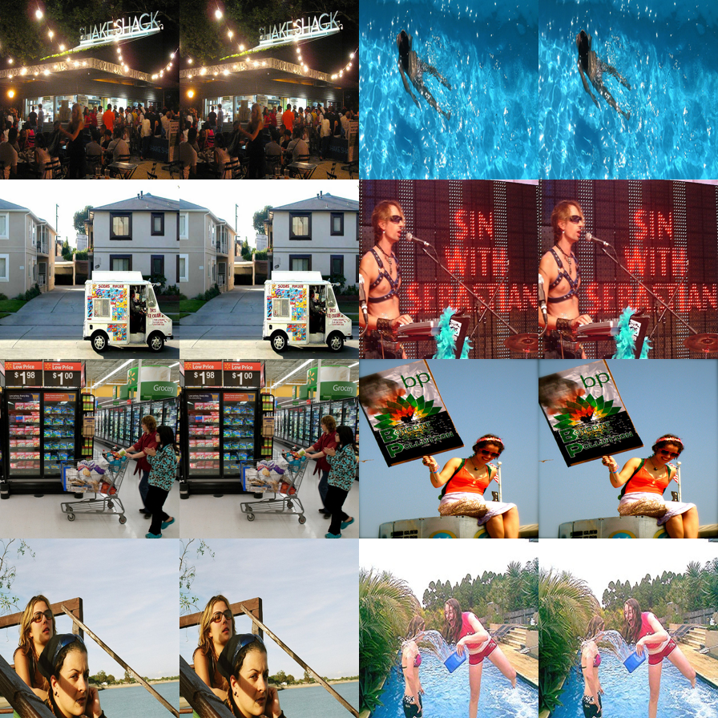    | This feature activates on images containing: man, group, people, sitting, tables. |
| no_clear     | 247       | 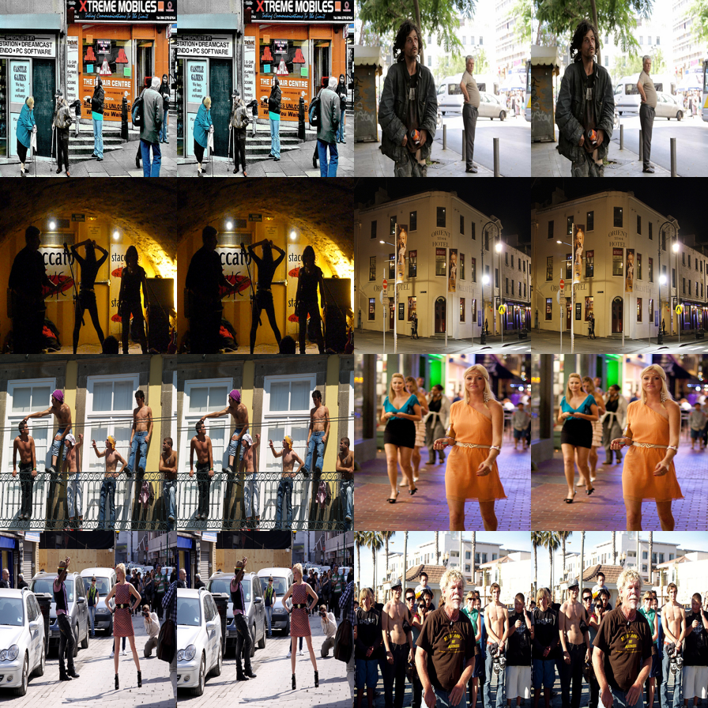    | This feature activates on images containing: street, man, group, people, walking. |
| no_clear     | 178       | 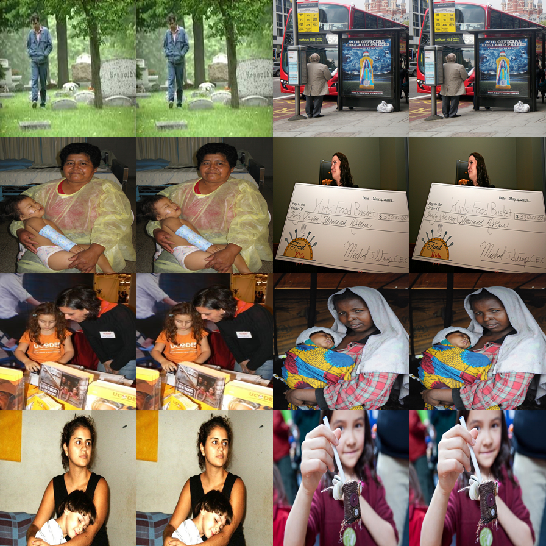    | This feature activates on images containing: woman, holding, man, walking, through. |
| too_specific | 44        | 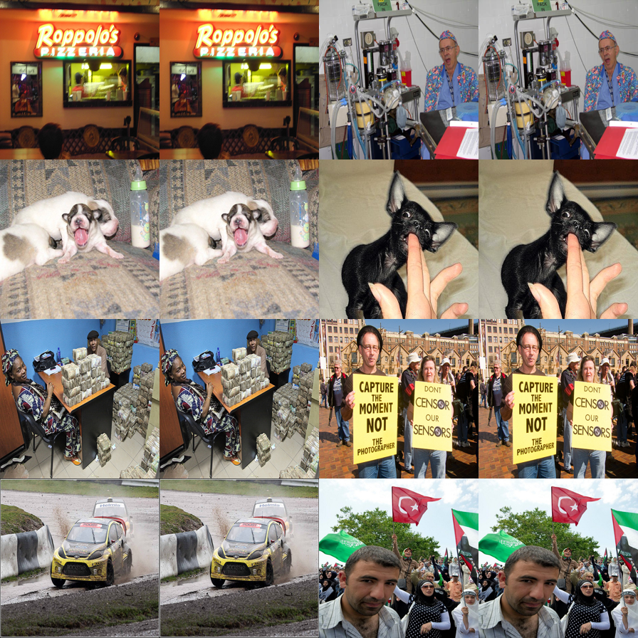     | This feature activates on images containing: small, restaurant, large, neon, sign. |
| too_specific | 132       | 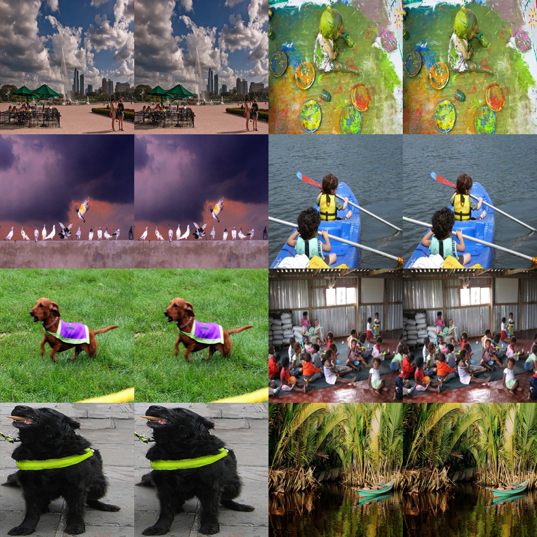    | This feature activates on images containing: blue, cloudy, sky, painting, white. |
| too_specific | 264       | 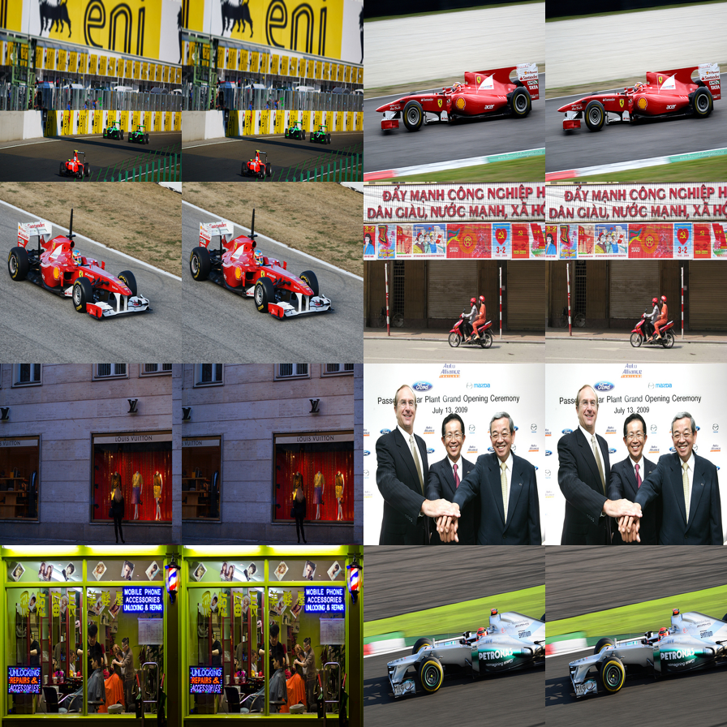    | This feature activates on images containing: yellow, fence, grass, green, red. |
| semantic     | 296       | 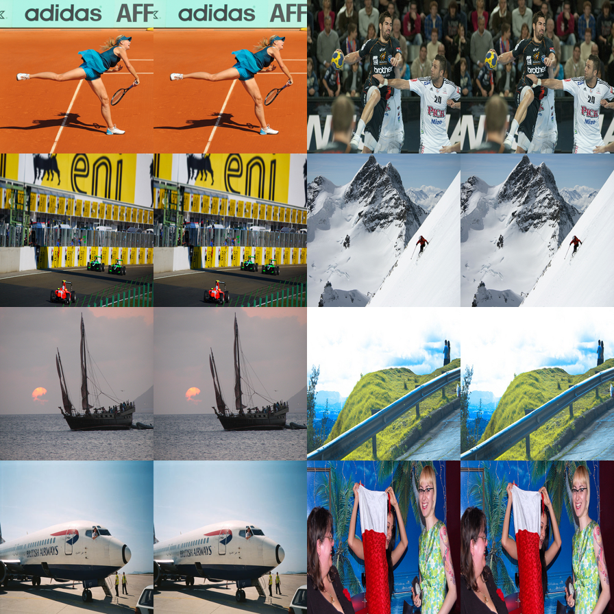    | This feature activates on images containing: woman, playing, tennis, man, wearing. |
| semantic     | 61        | 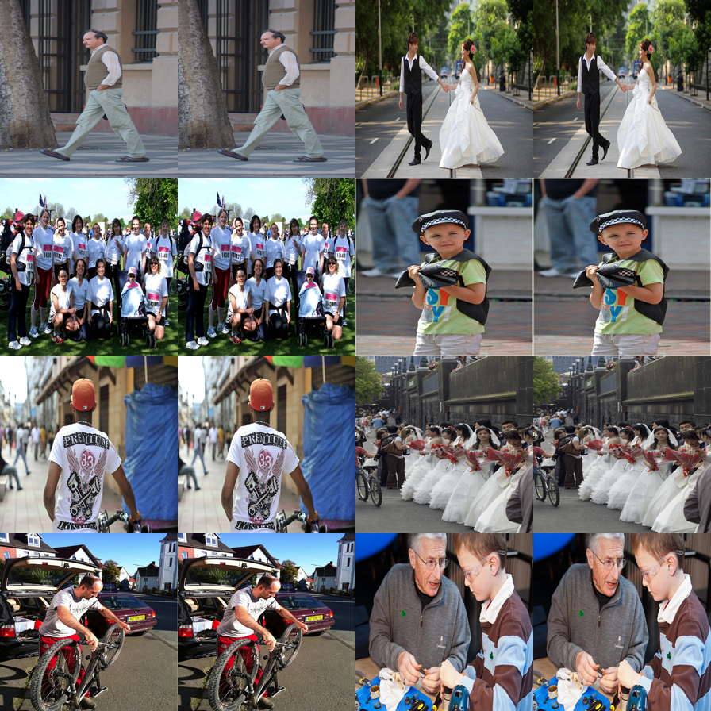     | This feature activates on images containing: walking, down, street, man, bride. |
| semantic     | 117       | 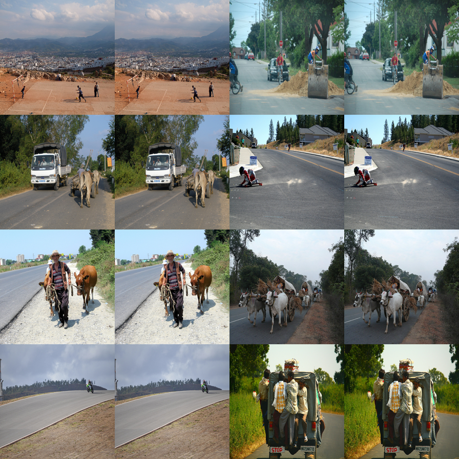    | This feature activates on images containing: down, group, people, playing, game. |
| favorite     | 109       | 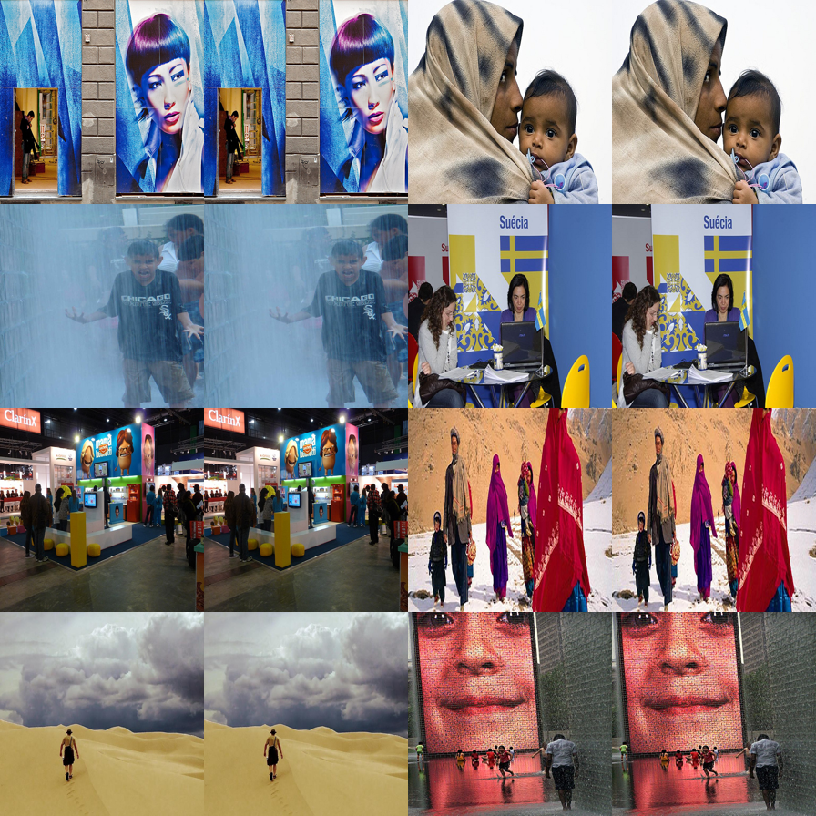    | This feature activates on images containing: woman, standing, front, wall, picture. |
| favorite     | 78        | 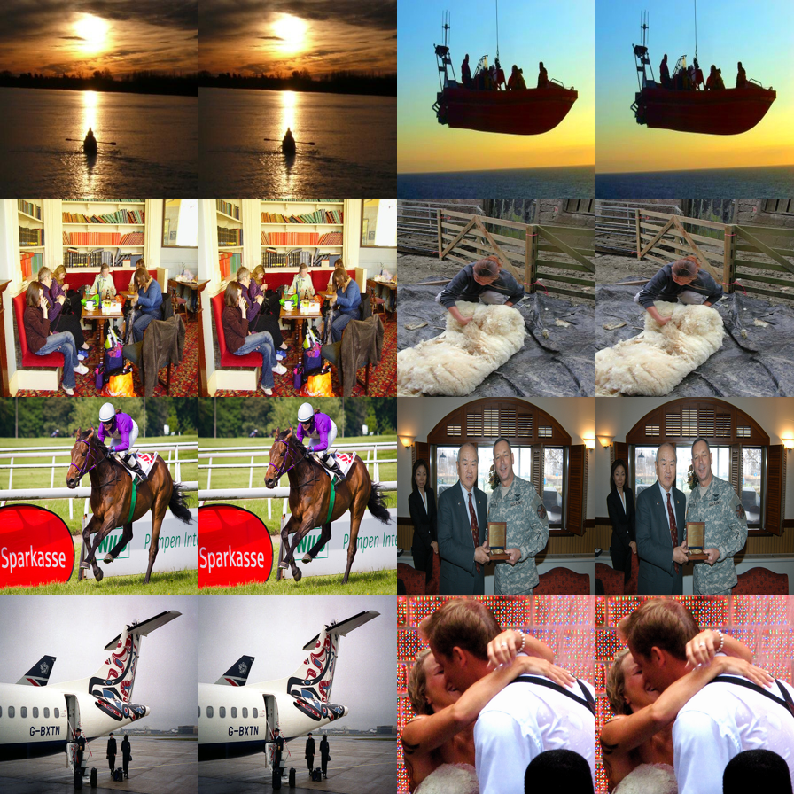     | This feature activates on images containing: person, kayak, pada, sunset, boat. |
| favorite     | 278       | 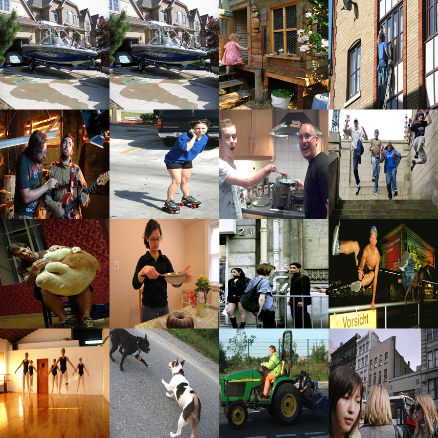    | This feature activates on images containing: boat, parked, front, house, man. |

## Kandinsky2.2 Steering (SAE features)
We trained an SAE on Kandinsky2.2 prior embeddings (1280-d) and steer generation by adding or subtracting a single latent direction in embedding space before decoding.

Latent 61
| orig | plus | minus |
| ---- | ---- | ----- |
|  |  |  |

Latent 117
| orig | plus | minus |
| ---- | ---- | ----- |
|  |  |  |

Latent 296
| orig | plus | minus |
| ---- | ---- | ----- |
|  |  |  |

For all examples, we use the same prompt and random seed, modifying only a single SAE latent direction,
which isolates the effect of the learned feature.

## Discussion
The results demonstrate a clear trade-off:
- Higher sparsity → stronger interpretability
- Slight degradation in downstream task accuracy

Despite this, the SAE preserves most of the semantic information present in CLIP embeddings while providing a transparent and analyzable latent space.

This supports the hypothesis that CLIP representations contain disentangled semantic structure that can be uncovered using sparse coding methods.

## Conclusion
In this project, we:
1. Extracted CLIP image embeddings from a large-scale dataset
2. Trained a Sparse Autoencoder to obtain sparse, interpretable representations
3. Evaluated the effect of SAE reconstruction on zero-shot classification
4. Demonstrated that individual SAE latents correspond to meaningful visual concepts

Overall, Sparse Autoencoders provide an effective tool for interpreting and analyzing CLIP representations with minimal loss in performance.
